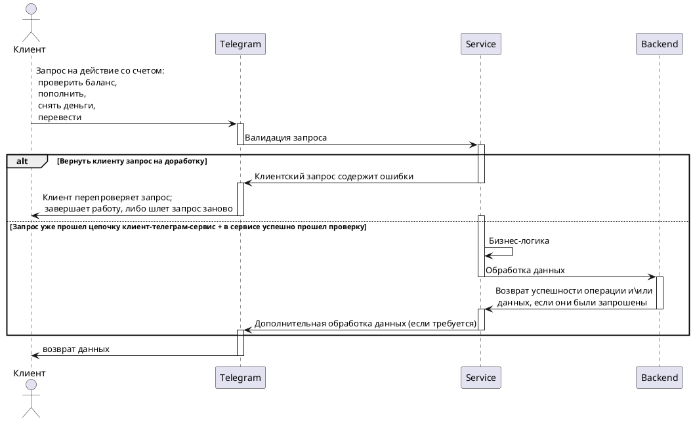

<h1 align="center"> khasmamedov-telegram-bot </h1>

<h1 align="center"> Банковское приложение с телеграмм-ботом и начинкой на java, c внешним хранилищем данных</h1>


### Базовое верхнеуровневое представление:  

<br/><br/>

<p align="left">
  <h3> Про проект в-общем: </h3>
  1. Бот является лишь пользовательским интерфейсом, что взаимодействует с пользователем (фронт) </i>
  <br/><br/>
  2. Сервис, или прослойка (движок), написанная на java, выполняет бизнес-логику и выступает прокладкой между фронтом и БД
  <br/><br/>
  3. Второй слой, или БД (аналог ДАО) - служит для хранения и обработки данных
  <br/><br/>
  <b><a href="https://gpb.fut.ru/itfactory/backend?utm_source=gpb&utm_medium=expert&utm_campaign=recommend&utm_content=all">GBP IT-factory</a></b> | <b><a href="">Документация(_пока пуста_)</a></b> | <b><a href="">Демо(_пока пуста_)</a></b> | <b><a href="https://github.com/gpb-it-factory/khasmamedov-telergam-bot">GitHub</a></b> <br>  
  <b><a href="#Как_запустить_и_начать_работу">Запуск и начало работы</a></b> <br>
  <b><a href="#Команды_бота">Команды_бота</a></b>
  <br/><br/>
  <a target="_blank" href="https://github.com/gpb-it-factory/khasmamedov-telergam-bot"></a>
  <br/><br/>

### Весь проект на диаграмме ниже:


### Как_запустить_и_начать_работу
<details>
  <summary>Подготовка программ/окружения</summary>

Для локальной установки приложения вам понадобятся [Git](https://git-scm.com/), [Java 21](https://axiomjdk.ru/pages/downloads/), [Gradle](https://gradle.org/), [IDEA](https://www.jetbrains.com/idea/download/)
</details>

<details>
  <summary>Получение токена</summary>

Вам нужен токен (действует как пароль), если его еще нет:    
см. [документацию](https://core.telegram.org/bots/tutorial#obtain-your-bot-token)

</details>

Способы запуска приложения - standAlone (1 и 2) и основной - как докер-приложение (3)

<details>
  <summary>Получение проекта</summary>

* Скачать проект с репозитория выше целиком [перейдя по ссылке на гитхаб](https://github.com/gpb-it-factory/khasmamedov-middle-service)    
  ````code -> download zip````    
  Распаковать архив, добавить в среду разработки как новый проект
* Либо, склонировать его      
  ````git@github.com:gpb-it-factory/khasmamedov-middle-service.git````  
  <span title="_в обоих случаях среда разработки сама подтянет gradle и зависимости_">примечание про зависимости</span>

</details>

<details>
  <summary>Запуск проекта отдельно (1, 2) </summary>

* Собрать проект в готовый к исполнению файл   
  ````gradle build````  (если есть установленный грэдл)
    + ИЛИ же ````.\gradlew build````  (если Windows и грэдла нет)
    + ИЛИ же ````chmod +x gradlew```` ````./gradlew build```` (если Linux и грэдла нет)
* Запустить его с параметрами:  
  ````java -jar ./build/libs/khasmamedov-telegram-bot-0.0.1-SNAPSHOT.jar --bot.token="здесь ваш токен"````  
  <span title="_, где после команды -jar идет путь (полный или относительный) до сборки; обычно это build/libs/_">примечание про пути</span>
* ИЛИ же - запуск проекта "под ключ":  
  ````.\gradlew.bat bootRun --args='--bot.token=<здесь ваш токен>' ```` (Windows)    
  ````./gradlew.bat bootRun --args='--bot.token=<здесь ваш токен>' ```` (Linux)  
  _!ВАЖНО: <> нужно удалять, токен будет в 'НАЗВАНИЕ_ТОКЕНА'_
  <span title="_ctrl+c, чтобы выйти из приложения в общем виде_  
  в последнем случае (Б), на вопрос:  
  ````Завершить выполнение пакетного файла [Y(да)/N(нет)]?```` -> y  ">как выйти из приложения</span>

</details>

<details>
  <summary>Запуск проекта через докер (3) </summary>

* Если у вас еще нет докера, нужно его скачать:  
  [ссылка на докер](https://docs.docker.com/get-docker/)
* Создать в докере image (посмотреть docker -> images в системе)  
  `docker build -t telegram-bot .`  
  <span title="если вы видите ошибку типа `ERROR [build 5/5] RUN ./gradlew build --no-daemon --stacktrace --info`, вам нужно будет запустить `gradle wrapper` и когда она пройдет - перезапустить сборку">возможная ошибка сборки</span>  
* Запустить приложение:
    + В фоновом режиме:  
      `docker run --name telegram-bot -d -e BOT_TOKEN="здесь ваш токен" telegram-bot`  
      _чтобы выйти в этом случае - набрать в терминале: `docker stop telegram-bot`_
    + С отображением результатов работы программы, включая логи и возможные ошибки:
      `docker run --name telegram-bot -it -e bot.token="здесь ваш токен" telegram-bot`  
      <span title="_ctrl+c, чтобы выйти из приложения в данном случае_">выход из приложения</span>
      <span title="_Если вы видите ошибку типа `docker: Error response from daemon: Conflict. The container name "/имя контейнера" is already in use by container "длинное имя". You have to remove (or rename) that container to be able to reuse that name.`,  
      вам потребуется остановить это контейнер перед тем как запускать программу:  
      `docker stop 23a960d080bd5798917cb70c5a33992c3ae2a715a9cd0187822cab80f632973e`
      `docker rm 23a960d080bd5798917cb70c5a33992c3ae2a715a9cd0187822cab80f632973e`_">примечание про ошибки контейнеров</span>

</details>

После запуска приложения можно открывать телеграм [web-версию](https://web.telegram.org), найти `@SomeBankBot`
и использовать <b><a href="#Команды_бота">Команды_бота</a></b> в нем
   

### Команды_бота

<details>
  <summary>Список команд бота на настоящий момент</code>: </summary>

<details>
  <summary>Обычные текстовые команды (echo-like, вопрос -> ответ)</summary>

* /ping -> pong
* /help -> no help for you now, use '/ping' command instead
* любая иная команда -> where is no place like home

</details>

<details>
  <summary>Команды пользователя с полным функционалом ((statusCode - состояние ошибки))</summary>

<details>
  <summary>Регистрация</summary>

1) Создать нового пользователя    
+ Ввести `/register` в ТГ-боте  
- Ответ в случае успеха: `Пользователь создан`        
- Ответ в случае попытки повторной регистрации того же пользователя: `Пользователь уже зарегистрирован: statusCode`       
- Ошибка создания пользователя: `Ошибка при регистрации пользователя: statusCode`  
- Прочие ошибки: `Не могу зарегистрировать, ошибка: детальное описание ошибки` _или_ `Произошла серьезная ошибка: детальное описание ошибки`  
2) Получить пользователя по идентификатору в Telegram  
_пока не реализовано_ (_и вероятно не будет нужно вообще_)

</details>

<details>
  <summary>Счета (_пока не реализовано_)</summary>

1) Открыть новый счёт для пользователя  
+ Ввести `/createaccount` в ТГ-боте
+ Ответ в случае успеха: `Счет создан`
- Ответ в случае попытки повторной регистрации того же пользователя: `Такой счет у данного пользователя уже есть: statusCode`
- Ошибка создания пользователя: `Ошибка при создании счета: statusCode`
- Прочие ошибки: `Не могу зарегистрировать счет, ошибка` _или_ `Произошла серьезная ошибка во время создания счета: детальное описание ошибки`

- открытие счёта в нашем Мини-банке. В данный момент у клиента может быть только один счёт  
2) Получить счета пользователя  
+ Ввести `/currentbalance` в ТГ-боте  
- 
Функционал (дорабатывается в н.м.) - получить текущий баланс открытого пользователем счёта;

</details>

</details>

<details>
  <summary>Переводы (_пока не реализовано_)</summary>

1) Создать перевод со счёта пользователя на счёт другого пользователя
+ Ввести `/transfer [toTelegramUser] [amount]` в ТГ-боте, где:
+ `toTelegramUser` - пользователь, на счёт которого совершается перевод, `amount` - сумма перевода.
-
Функционал (дорабатывается в н.м.) - перевод средств со счёта текущего пользователя на другой счёт по имени пользователя.

</details>


</details>

  
<br>

//Todo в этой ветке (отдельные задачи не нужны, относятся напрямую к заданию)

//1. все ручные тесты по запуску индивидуально (пока только зеленой кнопочкой вышло)
//(чудеса с консолью при rgadleW - не тестил бутран и докер, но по идее то же самое)
//2. компоуз
//4. апдейт ридми - частично уже есть + (команды), сдвигаю на низ, после докера апдейт
//- вероятно дополнительные тесты (экс 3) 

